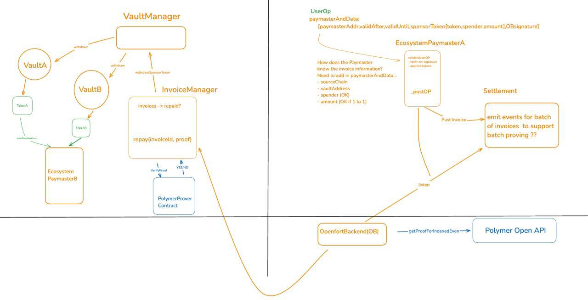
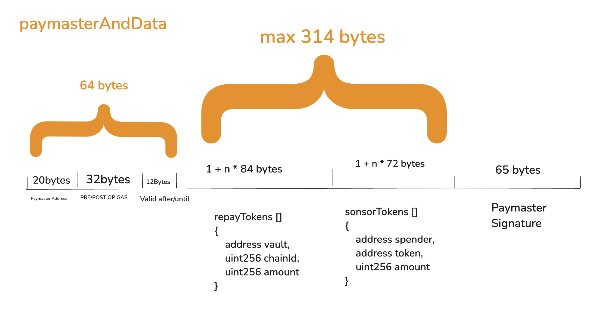

# Openfort Ecosystem abstraction

## Overview
Ecosystems serve as parent entities for groups of apps operating across different blockchains. Openfort [**ecosystem wallets**](https://www.openfort.xyz/docs/guides/ecosystem) enable seamless interoperability between applications, allowing ecosystems to design their ideal, unified wallet experience. The next evolution is consolidating user liquidity across apps, providing a single, unified dollar balance instantly spendable across the ecosystem. This vision will be powered by Openfort's advanced chain abstraction implementation based on [MagicSpend++](https://ethresear.ch/t/magicspend-spend-now-debit-later/19678/9) hosted in this repository. With this setup, ecosystems have the opportunitiy to become Liquidity Providers (LPs) for their users, sharing with them the value that would otherwise be captured by solvers/fillers.

You will find *at least* the following contracts:
* Time-locked Vault
* Vault Manager
* Chain Abstraction Paymaster
* Invoice Manager

## Architecture

## 4337 UserOP paymasterAndData accessible from the Chain Abstraction Paymaster

## Ecosystem Chain Abstraction Settings: accessible fromOpenfort Dashboard (product specs)

#### Vault
- Locking period
- ERC20 ticker? (depends if we decide that vault shares are ERC20)
- Supported chains
- Supported assets (each asset must have a correspondence in dollars)

#### Auto-fund amount
Ecosystems can choose to pre-fund their users’ accounts to reduce friction.
=> if it doesn't then user *MUST*  lock funds before activating chain abstraction 🚩

_Note:_ This "locking" can be simplified into a **SEND** transaction from an EOA to an AA. A backend watcher service could listen for `received` events and automatically lock the funds (i.e., transfer them to the time-locked vault). This approach would require users to sign a session key for the watcher service.

**Q:** Should the ecosystem remain the owner of the funds?

#### Paymaster
* Set/update the Paymaster owner address (the owner private key _MUST_ be owned by the ecosystem).
* Fund/withdraw Paymaster balance (Openfort crafts the transaction, but the ecosystem owner _MUST_ sign it).
* Set a webhook to receive alerts when the Paymaster balance falls below a certain threshold.
	The Paymaster fronts the funds on the destination chain for the user if they _HAVE_ enough locked balance (checked by the Paymaster Service). The Paymaster contract will then be reimbursed on the source chain(s). Ni1o: user has 100@A, 50@B, and spends 130@C

Trust assumptions:

* The system relies on cross-L2 execution proofs enabled by Polymer, eliminating the need for Users to trust Openfort or the Ecosystem. To recover funds locked in source chain vaults, the Ecosystem must prove the execution of the User Operation (UserOP) on the remote chain.

### Chain Abstraction Activation process

*for each* blockchain supported by the ecosystem:
* Deploy a custom ERC20 with ecosystem ticker representing the vaults' common "shares" (optional, share be represented as uint256 in the Vault implementation)
* Deploy one time-locked Vault implementation per supported ERC20, here is some inspiration:
    - [ERC-4626 Tokenize-Vaults](https://eips.ethereum.org/EIPS/eip-4626)
    - [ERC-7575 Multi-Asset vaults](https://eips.ethereum.org/EIPS/eip-7575)
* Deploy Vault Manager
* Deploy Invoice Manager
* Deploy the Chain Abstraction Paymaster

Bonus:
* The locked balance can technically generate a yield for users. Ethereum offers numerous DeFi primitives with instant liquidity access. Openfort and ecosystems could leverage this argument to incentivize users to lock funds.

